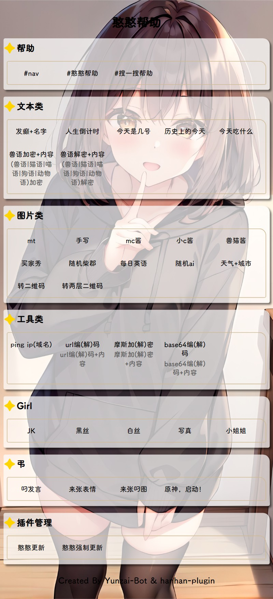
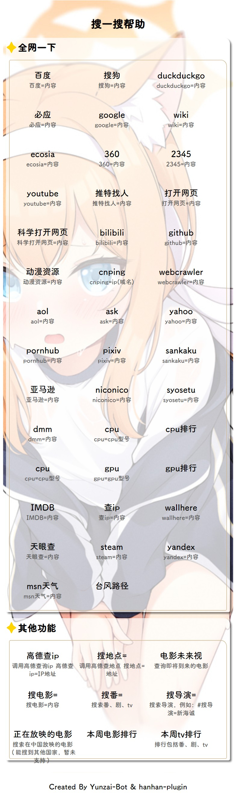

# hanhan-plugin
## 你不让我们用bot的居心何在？

我们的宗旨就是摆就完事了。

支持Yunzai-Bot、Miao-Yunzai和TRSS-Yunzai（部分支持）

## 安装

### Github
```bash:numbers
git clone https://github.com/hanhan258/hanhan-plugin.git ./plugins/hanhan-plugin
```

### Gitee
```bash:numbers
git clone https://gitee.com/han-hanz/hanhan-plugin.git ./plugins/hanhan-plugin
```

## 安装依赖，到yunzai根目录下执行
```bash:numbers
cd ./plugins/hanhan-plugin
pnpm i
```

搜一搜或许需要安装`google-chrome`，请自行搜索教程安装，并将`which google-chrome`得到的路径配置在`config.json`里面（config.example.json里面有示例，可以直接复制过去，修改路径即可）

操作完之后，启动你的机器人，就可以食用了

## nav

发送`#nav`或者`#憨憨帮助`查看功能



## 搜一搜帮助

发送`#搜一搜帮助`查看功能




## 说明
> 喜欢的话给个Star吧，爱你呦，么么哒

## 赞助

如果觉得本项目好玩或者对你有帮助，愿意的话可以赞助我一口快乐水：

https://afdian.net/a/hanhanbeea

## 贡献者

<!-- readme: collaborators,contributors -start -->
感谢以下贡献者

<a href="https://github.com/hanhan258/hanhan-plugin/graphs/contributors">
  
</a>

<!-- readme: collaborators,contributors -end -->


## Star History

[](https://api-star-history.com/#hanhan258/hanhan-plugin&Date)

[](https://github.com/hanhan258/hanhan-plugin/)
